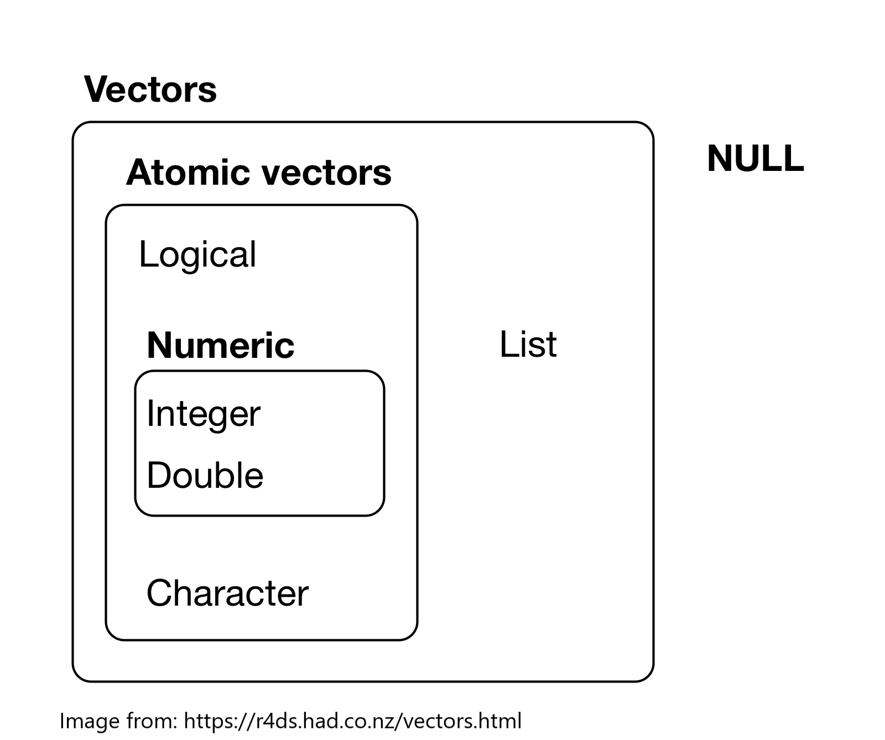

```{r setup, include=FALSE, exercise = TRUE}
# packages
library(learnr)
#devtools::install_github("rstudio-education/gradethis", force = TRUE)
library(gradethis)
library(readr)
library(dplyr)
library(ggplot2)

#sets gradethis as exercise checker
gradethis::gradethis_setup()

tutorial_options(exercise.reveal_solution = FALSE)

# hide non-exercise code chunks
knitr::opts_chunk$set(echo = FALSE)
```

# Intro to R for Biology:  Getting Data into R


## Introduction

Before you can start analyzing any data in R, you need to be able to get your data into R

Importing data into R can be more difficult than it sounds.  It is especially important to have the data in the right format before you even try to import it into R.  Once you have imported your data, you will need to check to see if it loaded correctly.

This tutorial helps you learn some tools to import and investigate the structure of a dataset.


### Learning goals

* Learn about objects and data types in R
* Learn about several functions to help investigate the structure of a data frame
* 
* 
* 


## Objects

To really understand how to import and look at the structure of data in R, we need to know some terminology.

Most often in R, we have our data in a table of rows and columns that we call a data frame. A data frame is a type of R **object**. 

There are lots of types of objects in R. Some commonly used object types include **vector**, **matrix**, **data frame**, and **list**.  Vectors and matrices can only be made of one data type, while data frames and lists can be mixed.

```{r data-structure, out.width = "100%"}
knitr::include_graphics("images/dataStructure.png")
```

Here are some resources to learn more about objects in R

* [Objects](https://cran.r-project.org/doc/manuals/r-release/R-lang.html#Objects): definition and types of objects
* [What's in a name?](https://r4ds.had.co.nz/workflow-basics.html#whats-in-a-name): some rules about how to name objects (No spaces!)


## Data Types

To understand more about the structure of a data frame, it is useful to know about types of data.  You can think of a data frame like a bunch of vectors stuck together, where each column is a former vector that has been glued to others.

There are six basic types each of which can make up a vector: **logical** (true/false/NA), **integer** (whole numbers), **double** (decimal number), **character** (string of text and/or numerals), **complex** (real + imaginary numbers), and **raw** (raw bytes of data as hexidecimal). Integer and double data types are both categorized as **numeric**.


```{r vector-types, out.width = "50%"}

```

You can click here to [learn more about vectors in R](https://r4ds.had.co.nz/vectors.html#vectors)

**Date time** and **factor** are two additional data types.  

* A **date time** data type includes dates and/or times. R stores dates as integers counting the number of days from January 1, 1970.
* A **factor** is how R deals with categorical variables.  A categorical variable is one that has a limited number of options, which R calls levels.  For example stoplight colors can only be green, red, or yellow.  If this was factor in a data frame, the column could be called "stoplight", and the levels would be "green", "red", or "yellow".  The only options in each cell of that column would be "green", "red", or "yellow" (and possibly NA if there was no value).


## Data Structure

When we load or import data into R, you will need to know the following to make sure your data has correctly loaded:

1. number of observations (=rows), 
2. names and number of variables (=columns), 
3. variables are correct type, and 
4. if there are categorical variables (=factors) that have different groups, then they have the right number of groups with the right labels (=levels)


Let's start with a built-in dataset to make sure you are familiar with the structure of datasets for use in R.  We will use the iris data to start with.

We can check the number of rows and columns in a dataset using the `dim()` function.

```{r dim, exercise=TRUE, message=FALSE}

dim(iris)

```

The first number in the `dim()` output is the number of rows and the second number is the number of columns.


To check the variable names (which are in the first row of each column) in a dataset, you can use the `names()` function.

```{r names, exercise=TRUE, message=FALSE}

names(iris)

```

As we saw in the Basics tutorial, we can use the `head()` function to look at the first few rows of a dataset (default is 6 rows)

```{r head, exercise=TRUE, message=FALSE}

head(iris)

```

##

We can look at the structure of the data frame more holistically by using the `str()` function. 

```{r structure, exercise=TRUE, message=FALSE}

str(iris)

```


The `str()` function gives the type of object and then the number of rows and columns on the first line. Then it lists each column and gives the variable name, variable type (numeric, factors, etc) and the first few values for the variable.  For factors it also gives the number of levels and the names of the first few levels.


- Class: mult_question
  Output: Which variable in the iris data frame is a factor? (you can scroll up through the console to see the results of the str() function)
  AnswerChoices: Species;Sepal.Length;Sepal.Width;Petal.Length;Petal.Width
  CorrectAnswer: Species
  AnswerTests: omnitest(correctVal='Species')
  Hint: The str() function gives output that lists the type of variable next to the name of each variable.  Which one says Factor next to it?

- Class: cmd_question
  Output: You can also use the View() function to see the whole dataset in a read-only spreadsheet form.  This is not practical for very large datasets but is fine for the iris dataset.  Type View(iris)
  CorrectAnswer: View(iris)
  AnswerTests: omnitest(correctExpr='View(iris)')
  Hint: Type View(iris) and then press Enter.

- Class: text
  Output: Now that you know how to look at the structure of a data frame, you may have noticed that the iris data frame has a particular structure.  Each column is a variable with the name of the variable in the first row.  After the first row (which has the column names), each row contains the values for one flower (we call this an "observation").  Each cell has a single value in it.

- Class: text
  Output: We call this type of structure "tidy" data. This course focuses on using a group of packages called the "tidyverse" that all require data to be in "tidy" format.

- Class: text
  Output: Note that variable names should be kept as short as possible and cannot have any spaces or special characters.  See the resources for this lesson for more information.

- Class: text
  Output: For all the lessons in this course, we will use a simple spreadsheet file format called a comma-separated values file or csv file to import data.  This file type is the most commonly used and will work with any software that can handle spreadsheets.  For most software, you can use functions such as SaveAs, Download as, or Export and chose .csv as the file type to make a csv file.

- Class: text
  Output: We are going to use a package called readr from the tidyverse suite of packages to import data.  So first you have to load the readr package. (note that readr should have been installed for you when you loaded this course in swirl)

- Class: cmd_question
  Output: Type library(readr) to load the readr package
  CorrectAnswer: library(readr)
  AnswerTests: omnitest(correctExpr='library(readr)')
  Hint: Type library(readr) in the console and then press Enter


- Class: cmd_question
  Output: Use the read_csv() function to load the hemlocks_diam.csv file and assign it to an object named hemlocks by typing hemlocks <- read_csv("hemlock_diam.csv")
  CorrectAnswer: hemlocks <- read_csv("hemlock_diam.csv")
  AnswerTests: omnitest(correctExpr='hemlocks <- read_csv("hemlock_diam.csv")')
  Hint: Type hemlocks <- read_csv("hemlock_diam.csv") then press Enter.  Type ?read_csv for more information about the read_csv function in the readr package.

- Class: text
  Output: If your data imported and you gave the object the right name, it should show up in the Global Environment panel in the upper right.  It also shows the number of observations (=rows) and variables (=columns) there as well.

- Class: cmd_question
  Output: How many rows are there in the hemlocks dataset? (type the number below)
  CorrectAnswer: 298
  AnswerTests: omnitest(correctExpr='298')
  Hint: Look at the number of observations for the hemlocks object in the Global Environment

- Class: cmd_question
  Output: How many columns are there in the hemlocks dataset? (type the number below)
  CorrectAnswer: 7
  AnswerTests: omnitest(correctExpr='7')
  Hint: Look at the number of variables for the hemlocks object in the Global Environment

- Class: cmd_question
  Output: Look at the structure of the hemlocks dataset using the str() function
  CorrectAnswer: str(hemlocks)
  AnswerTests: omnitest(correctExpr='str(hemlocks)')
  Hint: Type str(hemlocks)

- Class: mult_question
  Output: What type is the "date" variable in the hemlocks data frame according to the str() function? (you can scroll up through the console to see the output from the previous code)
  AnswerChoices: character (=chr);number (=num);factor (=Factor);logical (=logi); integer (=int); date (=date)
  CorrectAnswer: character (=chr)
  AnswerTests: omnitest(correctVal='character (=chr)')
  Hint: Type in str(hemlocks) and look at the type listed next to date.

- Class: text
  Output: Notice that some of the variables have the wrong type.  read_csv does its best to guess the right type for each column, but it doesn't always get them right.

- Class: cmd_question
  Output: To tell R the column called "date" is a date type this code in the console -- hemlocks <- read_csv("hemlock_diam.csv", col_types = cols(date = col_date(format = "%m/%d/%Y")))
  CorrectAnswer: hemlocks <- read_csv("hemlock_diam.csv", col_types = cols(date = col_date(format = "%m/%d/%Y")))
  AnswerTests: omnitest(correctExpr='hemlocks <- read_csv("hemlock_diam.csv", col_types = cols(date = col_date(format = "%m/%d/%Y")))')
  Hint: Type this code in the console -- hemlocks <- read_csv("hemlock_diam.csv", col_types = cols(date = col_date(format = "%m/%d/%Y")))

- Class: cmd_question
  Output: Look at the structure of the hemlocks dataset again using the str() function. (Hint - for a shortcut to code you previously typed in the console you can hit the up arrow key until you get to the code you want then edit if needed and press enter)
  CorrectAnswer: str(hemlocks)
  AnswerTests: omnitest(correctExpr='str(hemlocks)')
  Hint: Type str(hemlocks) in the console and then hit Enter

- Class: text
  Output: Note that the date column should now say it is a Date with the format "2016-03-08" etc.

- Class: text
  Output: Also note that all the columns with letters or words in them are imported as character strings.  This may be fine, but there are also times when we want a variable to be a factor when we want to use that variable for particular kinds of analysis or graphs.

- Class: cmd_question
  Output: To tell R the column called "location" is a factor type this code into the console -- hemlocks <- read_csv("hemlock_diam.csv", col_types = cols(location = col_factor(), date = col_date(format = "%m/%d/%Y")))
  CorrectAnswer: hemlocks <- read_csv("hemlock_diam.csv", col_types = cols(location = col_factor(), date = col_date(format = "%m/%d/%Y")))
  AnswerTests: omnitest(correctExpr='hemlocks <- read_csv("hemlock_diam.csv", col_types = cols(location = col_factor(), date = col_date(format = "%m/%d/%Y")))')
  Hint: Type this code in the console -- hemlocks <- read_csv("hemlock_diam.csv", col_types = cols(location = col_factor(), date = col_date(format = "%m/%d/%Y")))

- Class: cmd_question
  Output: Check the structure of the hemlocks data frame one last time using str() (remember - for a shortcut to code you previously typed in the console you can hit the up arrow key until you get to the code you want then edit if needed and press enter)
  CorrectAnswer: str(hemlocks)
  AnswerTests: omnitest(correctExpr='str(hemlocks)')
  Hint: Type str(hemlocks)

- Class: text
  Output: Notice that now the location column is listed as being a factor with 4 levels (these are the 4 different locations represented by abbreviations)

- Class: text
  Output: Now that you have successfully imported a data file into R, you can use it to visualize or analyze the data.

- Class: figure
  Output: Look at the Plots window in the lower right panel (select the Plots tab) to see a graph of the relationship between the log of the height and log of the diameter of hemlock trees for each location.
  Figure: tree.size.R
  FigureType: new

- Class: text
  Output: If you complete the remaining lessons in this course, you will be able to make graphs like this too.  Keep up the good work and come back to refresh these data importing skills anytime.

## Conclusion


## References


### Functions in R to look at the structure of data frames

* `dim()`  gives the dimensions (rows and columns) of a data frame
* `names()` gives the names of the variables in a data frame (the first row of all the columns)
* `head()` gives the first few rows of the data frame
* `str()` gives the structure of the data frame including the type of object, the number of rows and columns, and lists each variable with its type and first few values
* `glimpse()` function in the `dplyr` package is similar to the `str()` function


### Resources to help get data into R

* [Data Import Cheat Sheet](https://github.com/rstudio/cheatsheets/raw/master/data-import.pdf): how to import data with readr, how to make a tibble with the tibble package, and how to make data “tidy” with tidyr
* [Importing and "Tidy" Data](https://moderndive.com/4-tidy.html): ModernDive chapter on importing and tidy data
* [Tidy data](https://r4ds.had.co.nz/tidy-data.html#tidy-data-1): what tidy data is and how to get your data in tidy format
* [Data Import](https://r4ds.had.co.nz/data-import.html): help with importing data using the tidyverse readr package
* [Introduction to readr](https://readr.tidyverse.org/articles/readr.html): how to you the readr package to import data into R


